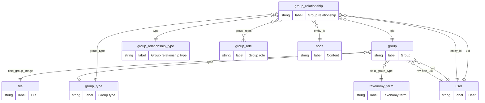

# Groups Entity-Relationship Diagram

Generated by `drush groups:erd --scope=group` from Drupal entity/field
metadata (not the database schema — see the `do_ops` ErdGenerator class
docblock for why). Do not hand-edit; regenerate and commit the diff instead.

