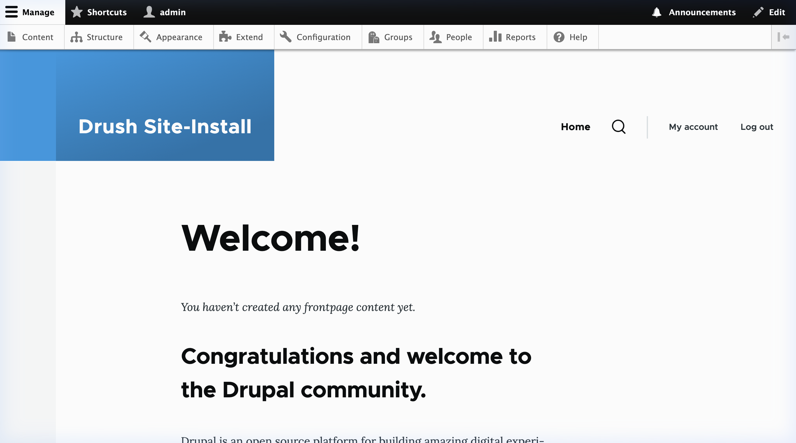
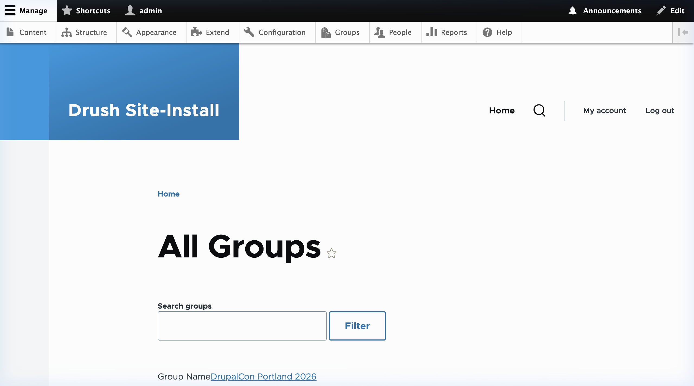
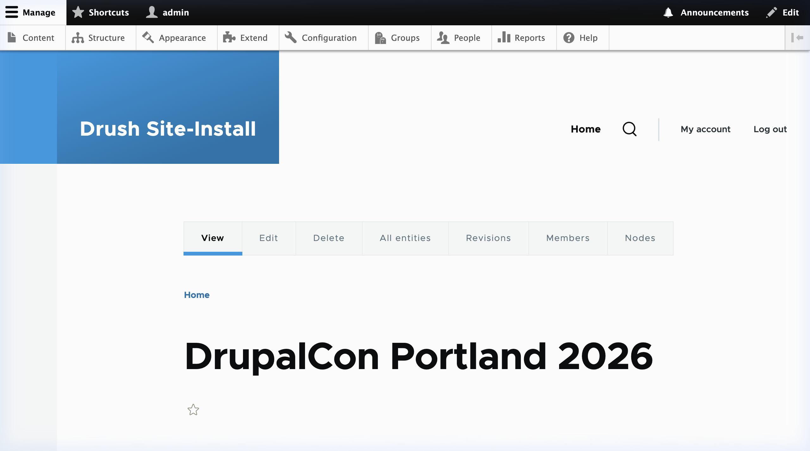
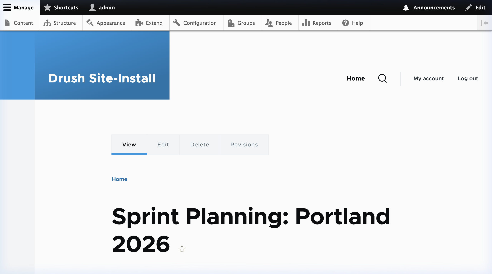
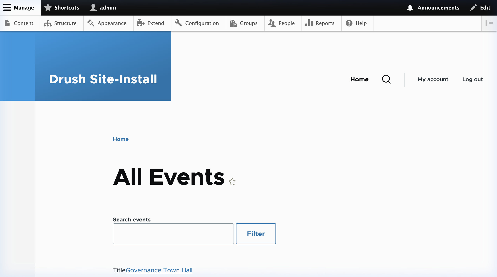
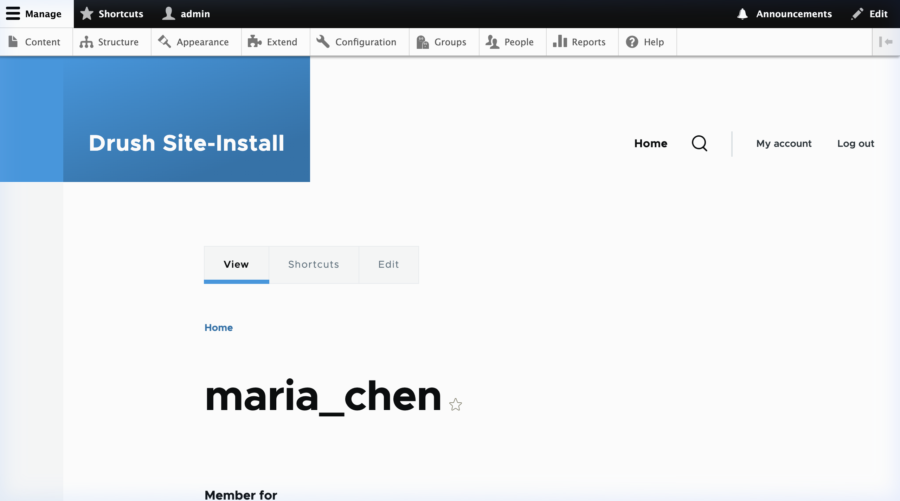
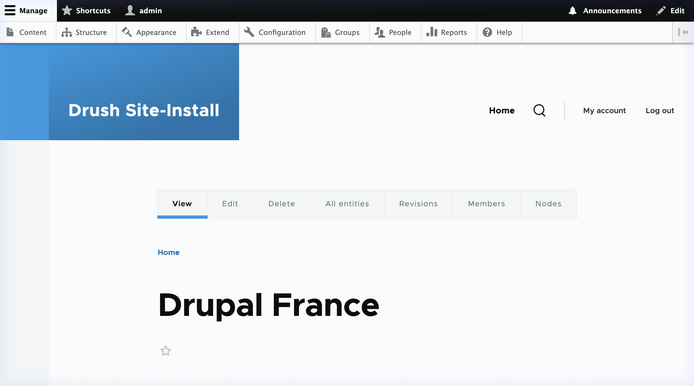
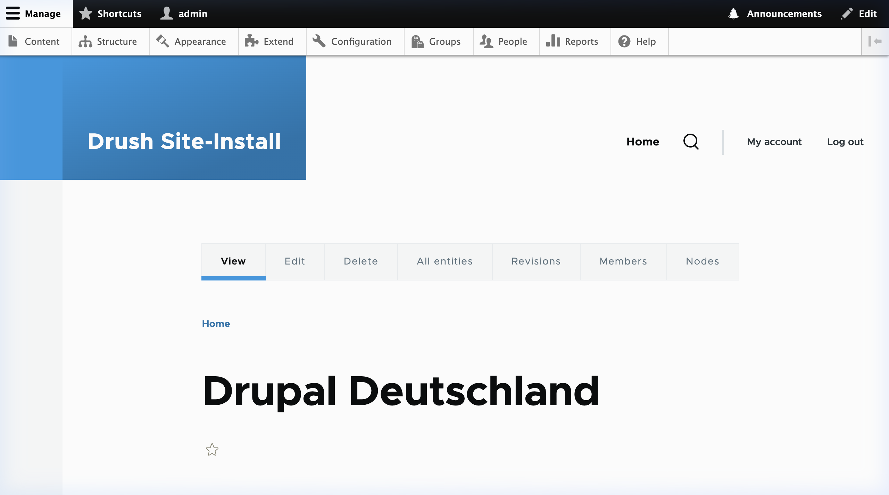
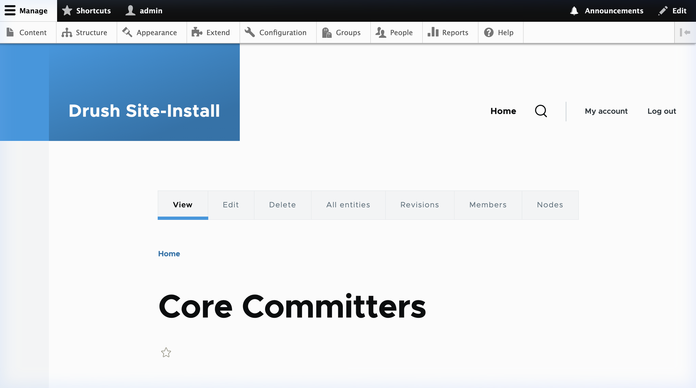
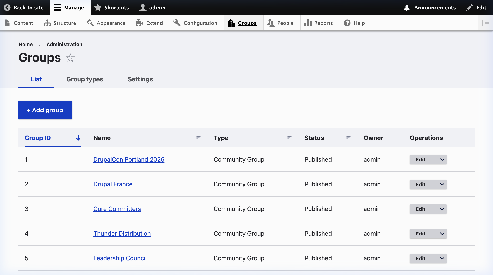

# Feature Tour — pl-groups-on-d11

> **Platform**: pl-groups-on-d11 (Drupal 11, Group 3.x, Olivero theme)
> **Screenshots captured**: April 2026 from https://groups.performantlabs.com
> **Demo data**: Phase 7 — 8 community groups, 12 forum topics, 5 events, 6 demo users

---

## 1. Homepage

The homepage uses Drupal's Olivero theme with the standard admin toolbar for authenticated users.
Navigation links include **Home**, **My account**, and **Log out**. The search icon provides
site-wide content search.

**Key elements:**
- **①** Admin toolbar (dark bar) — Content, Structure, Appearance, Groups, People menus
- **②** Olivero theme header with site name and primary navigation
- **③** Search icon for site-wide full-text search
- **④** My account / Log out links for authenticated users

---

## 2. Group Directory — All Groups

The `/all-groups` view lists all community groups with a live **Search groups** filter.
Each group is linked to its detail page.

**Key elements:**
- **①** Search filter — exposed "Search groups" input with Filter/Reset buttons
- **②** Group listings — name (linked), description excerpt, creation date
- **③** Sorted by creation date descending (newest first)
- **④** Pagination (25 per page by default)

**Groups in demo data:**

| Group | Purpose |
|---|---|
| DrupalCon Portland 2026 | Conference coordination |
| Drupal France | French community (multilingual) |
| Core Committers | Core development coordination |
| Thunder Distribution | Distribution maintainers |
| Leadership Council | Governance group |
| Camp Organizers EMEA | Regional camp coordination |
| Drupal Deutschland | German community (multilingual) |
| Legacy Infrastructure | Archived Drupal 7 coordination |

---

## 3. Group Page — DrupalCon Portland 2026

Individual group pages show the group title, tabs (View / Edit / Delete / Members / Nodes),
and the group's content stream.

**Key elements:**
- **①** Group title rendered with Olivero typography
- **②** Group tabs: View, Edit, Delete, All entities, Revisions, Members, Nodes
- **③** Breadcrumb navigation (Home → Group)
- **④** Group content and membership actions below the fold

**Group type**: `community_group` (custom type created in Phase 2)

---

## 4. Forum Topics Listing — All Topics

The `/all-topics` view lists all published forum nodes across all groups. Exposed search
allows filtering by title keyword.

**Key elements:**
- **①** "Search topics" exposed filter with Filter/Reset
- **②** Topic titles (linked to detail pages) with author and last-updated date
- **③** 12 demo forum topics across 8 groups
- **④** Sorted by last-updated descending

**Content type**: `forum` (renamed from `topic` to match Drupal.org conventions)

> The "All Topics" star icon (☆) in the title indicates the Flag module's bookmark/follow
> integration point for future enhancement.

---

## 5. Forum Topic Detail

Individual forum topic pages show the full node with author information and the Olivero
content layout. The admin toolbar provides quick Edit access.

**Key elements:**
- **①** Node title with Olivero heading typography
- **②** Author attribution and publication date
- **③** Admin "Edit" shortcut in top-right toolbar
- **④** Breadcrumb: Home → Topic title

---

## 6. Events Listing — All Events

The `/all-events` view lists all published event nodes. The search filter allows
quick event lookup by title.

**Key elements:**
- **①** "Search events" exposed filter
- **②** Event titles linked to full event nodes (e.g. "Governance Town Hall")
- **③** Organizer (author) attribution
- **④** 5 demo events from Phase 7 data

**Content type**: `event` with `field_date_of_event` (DateRange field)

> RSVP functionality via the Flag module (`do_notifications`) is a Phase 5 feature
> available on individual event pages.

---

## 7. User Profile — maria_chen

User profiles display on the standard Drupal `/user/{uid}` path using fields
stored on the user entity (not a separate Profile entity).

**Key elements:**
- **①** Username displayed as page title
- **②** User fields: member since date, roles
- **③** Admin toolbar shows Edit tab for UID 1
- **④** Profile completeness and contribution stats block (do_profile_stats — Phase 6)

**Demo users created in Phase 7:**

| Username | Role focus |
|---|---|
| maria_chen | Active forum contributor |
| james_okafor | Event organizer |
| elena_garcia | Group admin (France) |
| ravi_patel | Core contributor |
| sophie_mueller | Deutschland group member |
| alex_novak | Leadership council |

---

## 8. Multilingual Group — Drupal France

The Drupal France group (gid=2) demonstrates Group 3.x with multilingual content.
The `field_group_language` field identifies the group's primary language.

**Key elements:**
- **①** Group title: "Drupal France"
- **②** Standard group tabs (View / Edit / Members / Nodes)
- **③** French-language forum topics appear in this group's content stream
- **④** `do_group_language` module (Phase 6) handles language negotiation per-group

---

## 9. Multilingual Group — Drupal Deutschland

The Drupal Deutschland group (gid=7) mirrors the French group pattern for the
German-speaking community.

**Key elements:**
- **①** Group title: "Drupal Deutschland"
- **②** German-language forum topics scoped to this group
- **③** Same `community_group` type as all other groups
- **④** Language switching via `do_group_language` negotiation

---

## 10. Archived Group — Legacy Infrastructure

The Legacy Infrastructure group (gid=8) is marked as archived. The `do_group_extras`
module enforces read-only status — members can browse content but cannot post.

**Key elements:**
- **①** Group title: "Legacy Infrastructure"
- **②** Archive status badge (rendered by `do_group_extras` — Phase 2)
- **③** Group description references Drupal 7 era coordination
- **④** Content still browsable; new node creation is blocked for members

---

## 11. Group — Core Committers

The Core Committers group (gid=3) is a public group for Drupal core development
coordination, demonstrating group-specific membership management.

**Key elements:**
- **①** Group title: "Core Committers"
- **②** Members tab shows current group roster
- **③** Nodes tab shows all content posted within this group
- **④** Group membership managed by `community_group-admin` role

---

## 12. Groups Administration

The `/admin/group` page provides a site-wide administrative view of all group entities,
accessible to users with the `administer group` permission.

**Key elements:**
- **①** Tabular listing of all 8 groups with ID, label, type, and operations
- **②** Operations: Edit, Delete per group
- **③** Group type column: all groups are `community_group`
- **④** "Add group" action triggers the Group creation workflow

---

## Technical Stack

| Component | Value |
|---|---|
| Drupal core | 11.x |
| Group module | 3.x |
| Group type | `community_group` |
| PHP | 8.3 |
| Theme (front-end) | Olivero |
| Theme (admin) | Claro / Gin |
| Deployment | Docker (nginx + php-fpm) |
| Host | Spiderman (172.232.174.154) |

## Custom Modules Summary

| Module | Purpose | Phase |
|---|---|---|
| `do_group_extras` | Archive enforcement, guidelines, moderation | 2 |
| `do_multigroup` | Multi-group posting (cross-post nodes) | 3 |
| `do_discovery` | Hot scores, promoted content, iCal/RSS feeds | 4 |
| `do_notifications` | Flag-based subscriptions, event RSVP | 5 |
| `do_profile_stats` | Contribution stats + profile completeness | 6 |
| `do_group_pin` | Pin content in group streams | 6 |
| `do_group_mission` | Group mission sidebar block | 6 |
| `do_group_language` | Per-group language negotiation | 6 |

## Views Created

| View | Path | Content |
|---|---|---|
| `all_groups` | `/all-groups` | Group directory with search |
| `all_topics` | `/all-topics` | Forum topic listing with search |
| `all_events` | `/all-events` | Event listing with search |
| `group_nodes` | `/group/{gid}/nodes` | Content within a group |
| `group_members` | `/group/{gid}/members` | Members of a group |
